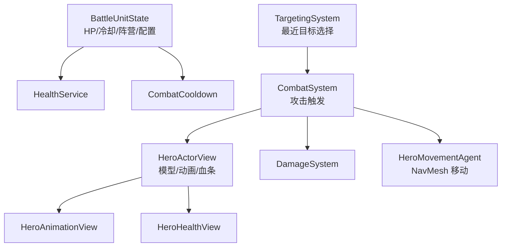
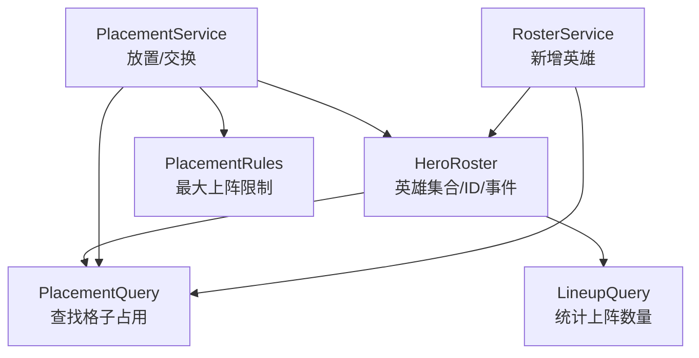

# 行数大于 100 的类整理

范围: `Assets/Scripts/**/*.cs`

统计结果: 当前只有 `Assets/Scripts/View/HeroView.cs` 超过 100 行。用户指定的 `Assets/Scripts/Data/Heroes.cs` 当前为 91 行，未超过 100，但职责集中，本文也作为重点候选整理。

## 行数统计 Top

| 文件 | 行数 | 是否超过 100 | 处理建议 |
|---|---:|---|---|
| `Assets/Scripts/View/HeroView.cs` | 108 | 是 | 必须拆分职责。 |
| `Assets/Scripts/Flow/Battle.cs` | 97 | 否 | 接近 100，后续战斗扩展前建议拆。 |
| `Assets/Scripts/Data/Heroes.cs` | 91 | 否 | 用户指定；职责集中，建议拆出站位服务。 |
| `Assets/Scripts/Config/HeroConfig.cs` | 81 | 否 | 当前多为配置数据，暂不优先拆。 |
| `Assets/Scripts/UI/UIShop.cs` | 78 | 否 | UI 和 Presenter 混合，后续可拆。 |

## HeroView.cs 职责拆解

当前 `HeroView` 方法和字段覆盖了多个方向，不应长期放在一个 View 类中。

| 当前成员/方法 | 当前行为 | 建议归属 |
|---|---|---|
| `Initialize(int, bool, HeroType)` | 设置 ID、阵营、读取配置、初始化血量、实例化模型、设置动画、导航参数、血条颜色 | 拆为 `HeroActorView.InitializeVisual`、`BattleUnitState.Initialize`、`HeroMovementAgent.Initialize` |
| `ChangeBlood(int)` | 修改血量、刷新血条、死亡隐藏对象 | 拆为 `HealthService.ApplyDelta`、`HeroHealthView.SetHpRatio`、`DeathView.Hide` |
| `IsAlive()` | 判断血量是否大于 0 | `BattleUnitState.IsAlive` |
| `BeginBattle()` | 启用 `NavMeshAgent` | `HeroMovementAgent.Enable` 或 `BattleActorPresenter.EnterBattle` |
| `Update()` | 每帧更新攻击冷却 | `CombatCooldown.Tick` |
| `FindTarget(HeroView[])` | 寻找最近目标、判断攻击距离、触发攻击事件、控制移动、播放动画 | 拆为 `TargetingSystem.FindNearest`、`CombatSystem.TryAttack`、`HeroMovementAgent.Chase/Stop`、`HeroAnimationView.PlayState` |

## HeroView 目标群聚

## HeroView 拆分建议

| 新目标类型 | 收纳内容 | 原因 |
|---|---|---|
| `HeroActorView` | 模型实例化、动画对象、血条颜色、死亡隐藏 | 纯表现层职责。 |
| `HeroHealthView` | `slider.value` 刷新 | UI 表现不应和血量规则混在一起。 |
| `BattleUnitState` | `id`、`isEnemy`、`Info`、当前血量、攻击冷却 | 战斗状态应独立于 Unity View。 |
| `HeroMovementAgent` | `NavMeshAgent` 速度、停止距离、启停、追击 | 移动控制是单独能力。 |
| `TargetingSystem` | 从候选目标中找最近存活目标 | 可测试、可替换 AI。 |
| `CombatSystem` | 判断距离、冷却、触发攻击 | 战斗规则归属。 |
| `HeroAnimationView` | `attack/idle/walk` 播放和 `walking` 参数 | 动画表现归属。 |

## Heroes.cs 职责拆解

`Heroes.cs` 未超过 100 行，但目前实际是“玩家英雄集合 + 站位规则 + 交换规则 + 查询”的混合体。

| 当前成员/方法 | 当前行为 | 建议归属 |
|---|---|---|
| `_heroes` / `Infos` | 保存英雄 ID 到 `HeroInfo` 的映射 | `HeroRoster` |
| `_nextHeroId` | 生成英雄 ID | `HeroIdGenerator` 或 `HeroRoster` 内部 |
| `AddHeroToBench(HeroType)` | 找空备战位，创建英雄数据 | `RosterService.AddToBench` + `PlacementQuery.FindFirstEmptyBench` |
| `Place(int, SlotIndex)` | 放置英雄；目标有英雄则交换；校验上阵数量 | `PlacementService.TryPlace` |
| `Exchange(int, int)` | 交换两个英雄格子；校验上阵数量 | `PlacementService.TrySwap` |
| `GetHeroIdBySlotIndex(SlotIndex)` | 查找格子上的英雄 ID | `PlacementQuery.FindHeroAt` |
| `GetBattleHeroCount()` | 统计战斗区英雄数量 | `LineupQuery.CountBattleHeroes` |
| `OnHeroesChange` | 数据变化通知 | `HeroRosterChanged` 事件 |

## Heroes 目标群聚

## Heroes 拆分建议

| 新目标类型 | 收纳内容 | 原因 |
|---|---|---|
| `HeroRoster` | `_heroes`、`Infos`、`_nextHeroId`、变化事件 | 数据容器只负责保存和发布变化。 |
| `RosterService` | `AddHeroToBench` | 添加英雄是用例，不应和查询、交换塞在一起。 |
| `PlacementService` | `Place`、`Exchange` | 放置和交换是站位操作。 |
| `PlacementQuery` | `GetHeroIdBySlotIndex` | 查询逻辑独立后可复用。 |
| `LineupQuery` | `GetBattleHeroCount` | 上阵数量查询独立后 UI 和规则都可用。 |
| `PlacementRules` | 最大上阵数量限制 | 规则独立后更容易测试和调整。 |

## 优先处理顺序

| 优先级 | 文件 | 操作 | 原因 |
|---:|---|---|---|
| 1 | `HeroView.cs` | 先拆 `FindTarget` 和 `ChangeBlood` | 这两个方法把战斗规则、状态和表现混在一起，是最大耦合点。 |
| 2 | `HeroView.cs` | 拆 `Update` 的攻击冷却 | 冷却属于战斗状态，不属于 View。 |
| 3 | `Heroes.cs` | 抽出 `PlacementService` | `Place/Exchange` 是完整的站位规则，应独立。 |
| 4 | `Heroes.cs` | 抽出 `PlacementQuery` 和 `LineupQuery` | 查询被多个地方使用，拆出后更清楚。 |
| 5 | `Battle.cs` | 后续拆 `DamageCalculator` 和 `BattleResultResolver` | 虽未超过 100 行，但战斗扩展会迅速膨胀。 |

## 最小改动版本

如果暂时不重构文件，只建议先做以下轻量整理:

| 文件 | 最小整理 |
|---|---|
| `HeroView.cs` | 用区域或注释先标出 `Visual`、`Health`、`Movement`、`Combat` 四块，作为后续拆分依据。 |
| `Heroes.cs` | 将 `CanPlaceToBattle` 判断抽成本类私有方法，减少 `Place` 和 `Exchange` 重复逻辑。 |
| `Heroes.cs` | 将 `GetHeroIdBySlotIndex` 改名为 `FindHeroIdBySlotIndex`，语义更准确。 |
