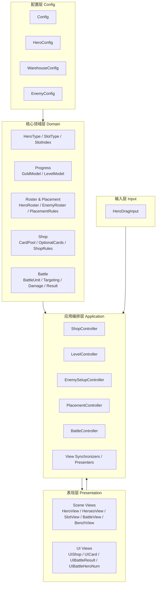
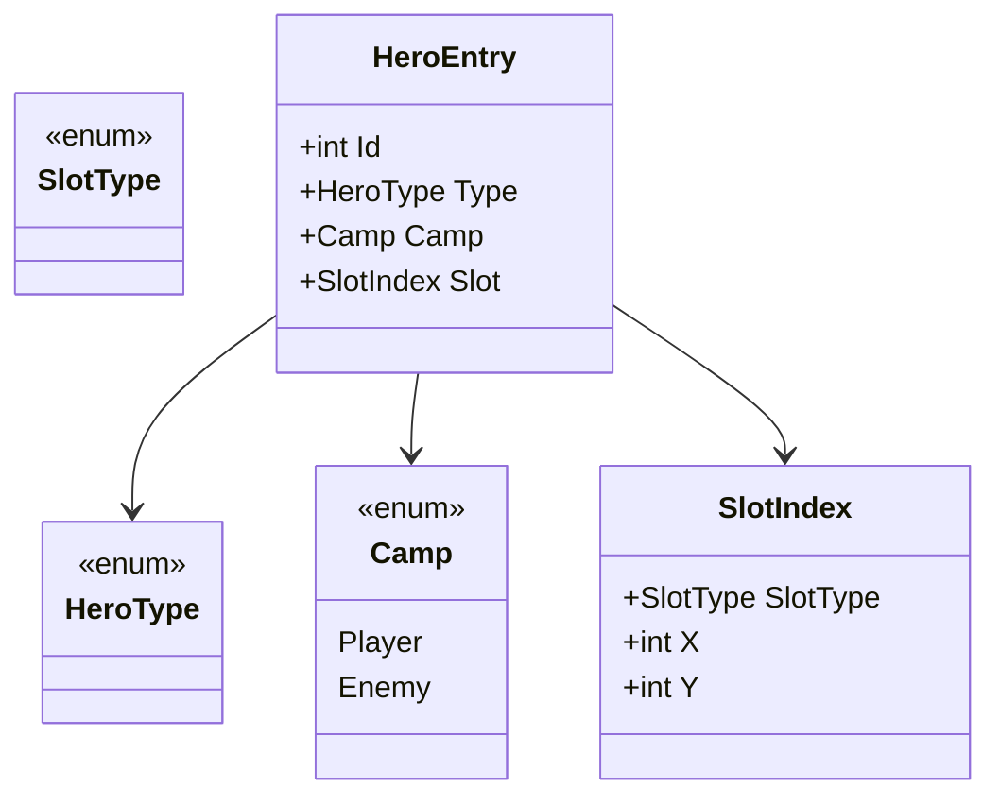
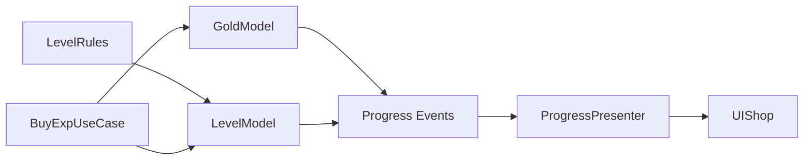
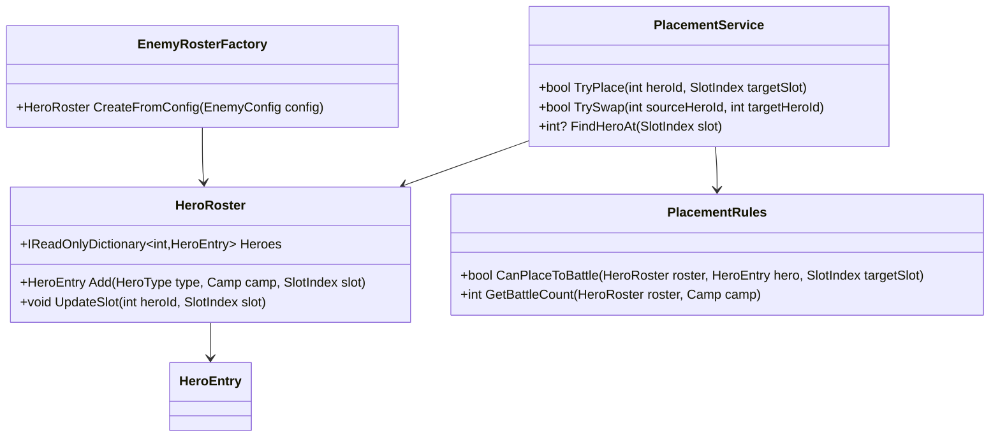
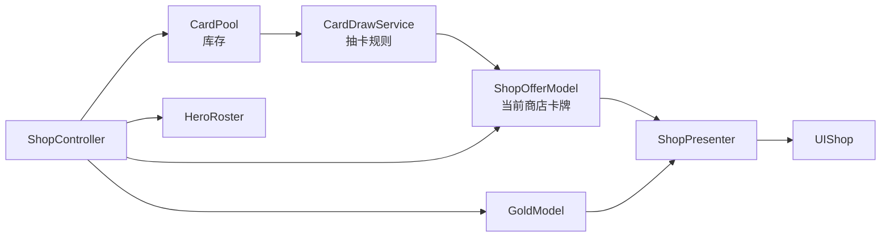
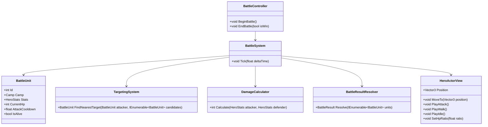
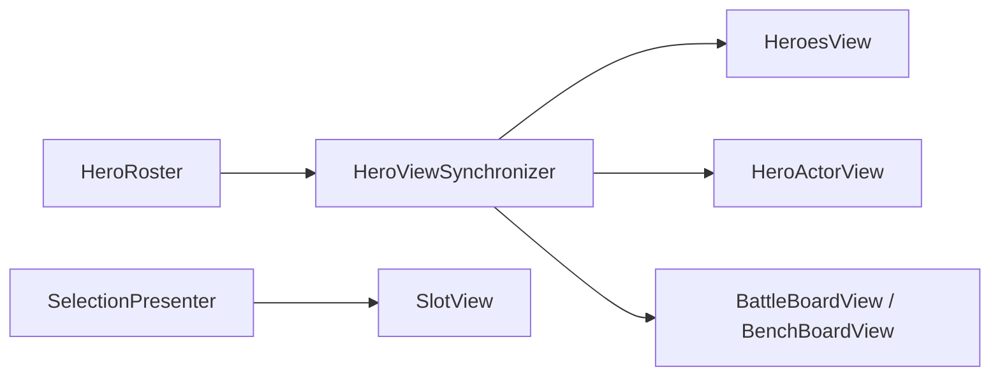
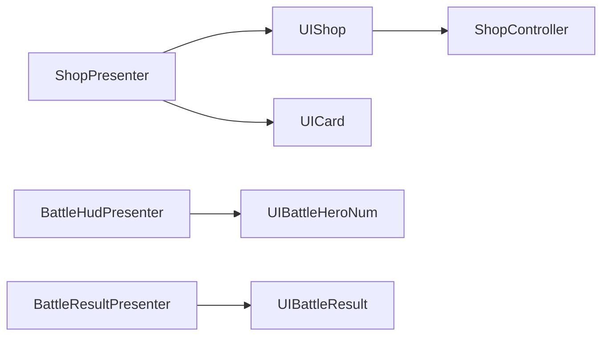
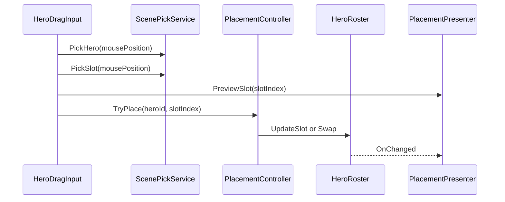
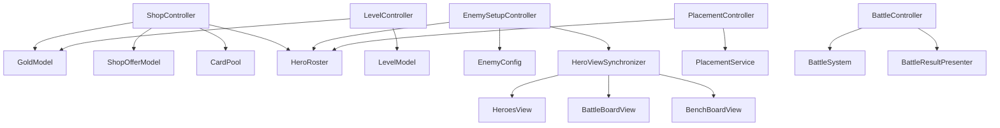

# Scripts 目标群聚状态

来源: `Assets/AI/Scripts_UML.md`

目的: 不按当前文件夹和现有类写法聚类，而是按职责边界重新划分模块。此文档描述更合理的目标架构群聚状态，不代表当前代码已经如此实现。

## 群聚原则

| 原则 | 说明 |
|---|---|
| 领域数据不依赖表现 | 英雄、金币、等级、卡池、阵容等数据不应知道 Unity UI、按钮、血条、动画。 |
| 规则独立于流程 | 伤害公式、上阵限制、升级规则、抽卡规则应归到规则/服务层，不应散落在 View 或 Flow。 |
| View 只负责显示 | UI 和场景 View 负责展示、输入事件转发，不直接决定业务结果。 |
| Controller/Presenter 做连接 | 数据模型、规则服务、UI、场景对象之间由协调层连接。 |
| 配置集中但不侵入 | `Config.Config` 是数据来源，但具体模块应只消费自己需要的配置切片。 |

## 推荐群聚总览

| 群聚 | 建议命名空间/目录 | 当前相关类 | 目标职责 |
|---|---|---|---|
| 核心领域模型 | `Domain` | `HeroInfo`, `EnemyHeroInfo`, `SlotIndex`, `HeroType`, `SlotType` | 表达游戏核心概念，不包含 Unity 表现逻辑。 |
| 玩家进度与资源 | `Domain.Progress` | `Data.Gold`, `Data.Level` | 管理金币、等级、经验等玩家状态。 |
| 英雄编队与站位 | `Domain.Roster` / `Domain.Placement` | `Heroes`, `EnemyHeroes` | 管理英雄拥有关系、阵营、站位、上阵限制。 |
| 商店与卡池 | `Domain.Shop` | `Warehouse`, `OptionalCards` | 管理卡池库存、备选卡牌、刷新、购买入口数据。 |
| 战斗领域 | `Domain.Battle` | `Flow.Battle`, `HeroView` 的战斗部分 | 管理战斗单位状态、寻敌、攻击、伤害、胜负。 |
| 表现场景层 | `Presentation.Scene` | `HeroView`, `HeroesView`, `SlotView`, `BattleView`, `BenchView`, `Tool.Billboard` | 负责 3D 对象、动画、血条、格子颜色和场景摆放。 |
| 表现 UI 层 | `Presentation.UI` | `UIShop`, `UICard`, `UIBattleResult`, `UIBattleHeroNum` | 负责 UI 显示和按钮事件暴露。 |
| 输入交互层 | `Input` / `Interaction` | `HeroMover` | 负责鼠标拖拽、射线检测、选择格子。 |
| 应用编排层 | `Application` | `Flow.Flow`, `PlayerHeroesRefresher`, `Battle` 的流程部分 | 连接领域模型、规则服务、表现层和输入层。 |
| 配置层 | `Config` | `Config.Config`, `HeroConfig`, `WarehouseConfig`, `EnemyConfig` | 提供可编辑配置和配置查询。 |

## 目标群聚图

## 群聚 1: 核心领域模型

### 当前成员

| 当前类型 | 当前文件 | 建议归属 | 说明 |
|---|---|---|---|
| `HeroType` | `HeroType.cs` | `Domain` | 英雄类型是全局领域概念。 |
| `SlotType` | `SlotType.cs` | `Domain` | 格子类型是站位领域概念。 |
| `SlotIndex` | `SlotIndex.cs` | `Domain.Placement` | 位置值对象，适合作为纯数据结构。 |
| `HeroInfo` | `Data/Heroes.cs` | `Domain.Roster` | 玩家英雄数据。建议升级为通用 `HeroEntry`。 |
| `EnemyHeroInfo` | `Data/EnemyHeroes.cs` | `Domain.Roster` | 敌方英雄数据。建议和 `HeroInfo` 合并或统一结构。 |

### 建议目标结构

### 归属判断

| 项 | 判断 |
|---|---|
| `HeroInfo` 和 `EnemyHeroInfo` | 不建议分裂成两套结构，差异只是阵营和站位表达。统一后战斗、显示、摆放逻辑会更简单。 |
| `SlotIndex.Equals/GetHashCode` | 继续属于值对象本身，归属合理。 |

## 群聚 2: 玩家进度与资源

### 当前成员

| 当前类型 | 当前职责 | 建议归属 |
|---|---|---|
| `Data.Gold` | 金币数量、增加、消费、变化通知 | `Domain.Progress.GoldModel` |
| `Data.Level` | 等级、经验、升级、变化通知 | `Domain.Progress.LevelModel` |
| `UIShop.RefreshGold/RefreshLevel` | 展示金币和等级 | `Presentation.UI` |
| `Flow.HandleBuyExp` | 消耗金币购买经验 | `Application.LevelController` 或 `ShopController` |

### 目标关系

### 归属判断

| 当前成员 | 问题 | 建议 |
|---|---|---|
| `Level.AddExp` | 升级规则直接写在模型里可以接受，但边界检查和规则可测试性较弱。 | 小项目可保留；如果要扩展，拆 `LevelRules`。 |
| `Gold.ConsumeGold` | 属于资源模型，归属合理。 | 保留在资源模型。 |
| `UIShop` 订阅 `Gold/Level` | UI 直接知道数据模型。 | 移到 `ProgressPresenter`。 |

## 群聚 3: 英雄编队与站位

### 当前成员

| 当前类型/方法 | 当前职责 | 建议归属 |
|---|---|---|
| `Heroes.Infos` | 玩家英雄集合 | `HeroRoster` |
| `Heroes.AddHeroToBench` | 添加英雄到空备战位 | `RosterService` + `PlacementService` |
| `Heroes.Place` | 放置或交换英雄 | `PlacementService` |
| `Heroes.Exchange` | 交换站位 | `PlacementService` |
| `Heroes.GetBattleHeroCount` | 统计上阵数量 | `LineupQuery` 或 `PlacementRules` |
| `EnemyHeroes.Awake` | 从配置生成敌方阵容 | `EnemySetupController` + `HeroRoster` |
| `PlayerHeroesRefresher` | 数据变更后刷新视图 | `Presentation Synchronizer` |

### 目标结构

### 归属判断

| 当前成员 | 判断 |
|---|---|
| `Heroes` | 当前把集合、站位、交换、规则放在一起。建议拆出 `PlacementService`。 |
| `EnemyHeroes` | 当前和 `Heroes` 重复。建议变成同一个 `HeroRoster` 的敌方初始化流程。 |
| `PlayerHeroesRefresher` | 不属于 Flow。它是数据到 View 的同步器，应归到 Presentation/Application 边界。 |

## 群聚 4: 商店与卡池

### 当前成员

| 当前类型/方法 | 当前职责 | 建议归属 |
|---|---|---|
| `Warehouse` | 卡池库存、抽卡、回收 | `CardPool` + `CardDrawService` |
| `OptionalCards` | 商店候选卡牌 | `ShopOfferModel` |
| `Flow.HandleCardClick` | 购买卡牌 | `ShopController` |
| `Flow.HandleShopRefresh` | 刷新商店 | `ShopController` |
| `UIShop` / `UICard` | 商店展示与按钮 | `Presentation.UI.Shop` |

### 目标结构

### 归属判断

| 当前成员 | 问题 | 建议 |
|---|---|---|
| `Warehouse.RandomTakeout` | 库存和随机抽取耦合。 | 小项目可接受；扩展概率/等级池时应拆 `CardDrawService`。 |
| `OptionalCards` | 名字偏 UI，实质是商店 Offer 数据。 | 改为 `ShopOfferModel` 更准确。 |
| `Flow.HandleCardClick` | 商店购买流程不应在泛化 `Flow` 类。 | 移入 `ShopController.BuyCard(index)`。 |

## 群聚 5: 战斗系统

### 当前成员

| 当前类型/方法 | 当前职责 | 建议归属 |
|---|---|---|
| `Flow.Battle.BeginBattle` | 开战流程 | `BattleController` |
| `Flow.Battle.Update` | 每帧战斗驱动和胜负判断 | `BattleSystem` + `BattleResultResolver` |
| `Flow.Battle.HandleAttack` | 伤害公式 | `DamageCalculator` |
| `HeroView.FindTarget` | 寻敌、追击、攻击触发、动画切换 | 拆为 `TargetingSystem` / `CombatAgent` / `HeroView` |
| `HeroView.ChangeBlood` | 扣血和血条刷新 | 拆为 `BattleUnitState.TakeDamage` + `HeroView.SetHpRatio` |
| `HeroView.BeginBattle` | 启用导航 | `HeroActorView` 或 `CombatAgentView` |

### 目标结构

### 归属判断

| 当前成员 | 判断 |
|---|---|
| `HeroView.FindTarget` | 当前最不合适的归属。寻敌和攻击是战斗逻辑，不是 View。 |
| `HeroView.ChangeBlood` | 状态变化和 UI 刷新混在一起。建议拆。 |
| `Battle.HandleAttack` | 伤害公式应该是独立规则，方便测试和平衡调整。 |
| `Battle.Update` | 同时驱动战斗和判断胜负，后续会膨胀。 |

## 群聚 6: 表现场景层

### 当前成员

| 当前类型 | 建议保留职责 | 不建议继续承担 |
|---|---|---|
| `HeroView` | 模型实例化、动画播放、血条显示、位置/导航表现 | 寻敌、扣血规则、伤害结算、战斗胜负 |
| `HeroesView` | 维护 ID 到 `HeroView` 的映射、创建/销毁英雄视图 | 决定英雄业务状态 |
| `SlotView` | 格子颜色、选中态显示、暴露 `SlotIndex` | 判断是否可放置 |
| `BattleView` | 构建战斗格子、提供格子位置查询 | 战斗规则 |
| `BenchView` | 构建备战格子、提供格子位置查询 | 上阵规则 |
| `Tool.Billboard` | 朝向摄像机 | 无需迁移 |

### 目标结构

### 归属判断

| 当前成员 | 判断 |
|---|---|
| `HeroesView.RefreshHeroes` | 适合留在表现层，但内部删除字典元素方式需要修正。 |
| `BattleView/BenchView` | 归属合理，本质是棋盘表现和位置查询。 |
| `SlotView.SetSelected` | 归属合理，选中态是表现。 |

## 群聚 7: 表现 UI 层

### 当前成员

| 当前类型 | 建议保留职责 | 不建议继续承担 |
|---|---|---|
| `UIShop` | 显示卡牌、金币、等级文本；暴露点击事件 | 直接订阅 `Gold/Level/OptionalCards` |
| `UICard` | 单张卡牌显示和点击事件 | 业务购买逻辑 |
| `UIBattleResult` | 显示胜负 | 胜负判断 |
| `UIBattleHeroNum` | 显示当前/最大上阵数 | 直接查询 `Heroes` 和 `Config` |

### 目标结构

### 归属判断

| 当前成员 | 判断 |
|---|---|
| `UIShop.Start` | 当前承担 Presenter 职责。建议把订阅模型事件移走。 |
| `UIBattleHeroNum` | 当前直接依赖 `Heroes`，建议只接收 `SetValue(current, max)`。 |

## 群聚 8: 输入交互层

### 当前成员

| 当前类型/方法 | 当前职责 | 建议归属 |
|---|---|---|
| `HeroMover.Update` | 鼠标射线、拖动英雄、选择格子、请求换位 | 拆为 `HeroDragInput` + `PlacementController` |

### 目标结构

### 归属判断

| 当前成员 | 判断 |
|---|---|
| `HeroMover` | 输入检测属于输入层，但 `heroes.Place` 的业务结果不应由输入类决定细节。它只应发起意图。 |

## 群聚 9: 应用编排层

### 当前成员

| 当前类型 | 当前职责 | 建议目标 |
|---|---|---|
| `Flow.Flow` | 商店、经验、敌方初始化总协调 | 拆成 `ShopController`, `LevelController`, `EnemySetupController` |
| `Flow.Battle` | 战斗流程和规则混合 | 拆成 `BattleController`, `BattleSystem`, `DamageCalculator` |
| `PlayerHeroesRefresher` | 玩家英雄视图同步 | 改名为 `HeroViewSynchronizer` 或 `PlayerRosterPresenter` |

### 目标编排图

## 从当前类到目标群聚的映射

| 当前类/文件 | 推荐目标群聚 | 建议目标类型 |
|---|---|---|
| `HeroType.cs` | 核心领域模型 | `Domain.HeroType` |
| `SlotType.cs` | 核心领域模型 | `Domain.Placement.SlotType` |
| `SlotIndex.cs` | 核心领域模型 | `Domain.Placement.SlotIndex` |
| `Data/Heroes.cs` | 英雄编队与站位 | `HeroRoster`, `PlacementService`, `PlacementRules` |
| `Data/EnemyHeroes.cs` | 英雄编队与站位 | `EnemyRosterFactory` 或统一 `HeroRoster` |
| `Data/Gold.cs` | 玩家进度与资源 | `GoldModel` |
| `Data/Level.cs` | 玩家进度与资源 | `LevelModel`, 可选 `LevelRules` |
| `Data/Warehouse.cs` | 商店与卡池 | `CardPool`, `CardDrawService` |
| `Data/OptionalCards.cs` | 商店与卡池 | `ShopOfferModel` |
| `HeroView.cs` | 表现场景层 + 战斗系统 | 拆为 `HeroActorView`, `BattleUnit`, `CombatAgent` |
| `HeroesView.cs` | 表现场景层 | `HeroesView` 或 `HeroViewRegistry` |
| `SlotView.cs` | 表现场景层 | `SlotView` |
| `BattleView.cs` | 表现场景层 | `BattleBoardView` |
| `BenchView.cs` | 表现场景层 | `BenchBoardView` |
| `UI/UIShop.cs` | 表现 UI 层 + 应用编排层 | 拆为 `UIShop`, `ShopPresenter` |
| `UI/UICard.cs` | 表现 UI 层 | `UICard` |
| `UI/UIBattleResult.cs` | 表现 UI 层 | `UIBattleResult` |
| `UI/UIBattleHeroNum.cs` | 表现 UI 层 + Presenter | 拆为 `UIBattleHeroNum`, `BattleHeroNumPresenter` |
| `Flow/Flow.cs` | 应用编排层 | `ShopController`, `LevelController`, `EnemySetupController` |
| `Flow/Battle.cs` | 应用编排层 + 战斗系统 | `BattleController`, `BattleSystem`, `DamageCalculator`, `BattleResultResolver` |
| `Flow/HeroMover.cs` | 输入交互层 + 应用编排层 | `HeroDragInput`, `PlacementController` |
| `Flow/PlayerHeroesRefresher.cs` | 表现同步 | `HeroViewSynchronizer` |
| `Tool/BillBoard.cs` | 表现场景层/工具 | `Billboard` |
| `Config/*.cs` | 配置层 | 保留，但建议拆出配置查询接口或配置切片 |

## 推荐重构顺序

| 顺序 | 操作 | 原因 |
|---|---|---|
| 1 | 把 `HeroView` 中的战斗逻辑标记为目标迁移对象 | 这是当前耦合最高的位置。 |
| 2 | 把 `Battle.HandleAttack` 抽成 `DamageCalculator` | 成本低，收益高，便于测试伤害公式。 |
| 3 | 把 `Flow.Flow` 拆成 `ShopController` 和 `LevelController` | 避免总流程类继续膨胀。 |
| 4 | 把 `UIShop` 的数据订阅迁移到 `ShopPresenter` | 明确 UI 和数据模型边界。 |
| 5 | 统一 `Heroes` 与 `EnemyHeroes` 的数据结构 | 为战斗系统和视图同步打基础。 |
| 6 | 拆 `Warehouse` 为卡池和抽卡规则 | 为等级概率、权重、稀有度做准备。 |

## 最小可落地版本

如果暂时不大改代码，可以先按以下群聚理解和命名，不一定立即拆文件。

| 保留当前类 | 先调整认知归属 | 后续可迁移点 |
|---|---|---|
| `Heroes` | 编队与站位模型 | 抽出 `PlacementService` |
| `Warehouse` | 商店卡池模型 | 抽出 `CardDrawService` |
| `OptionalCards` | 商店 Offer 模型 | 改名 `ShopOfferModel` |
| `HeroView` | 表现场景对象 | 拆出 `BattleUnit` 和 `CombatAgent` |
| `Flow.Battle` | 战斗编排器 | 抽出 `DamageCalculator` 和 `BattleResultResolver` |
| `Flow.Flow` | 商店/进度编排器 | 拆成具体 Controller |
| `UIShop` | UI + Presenter 混合体 | 抽出 `ShopPresenter` |
