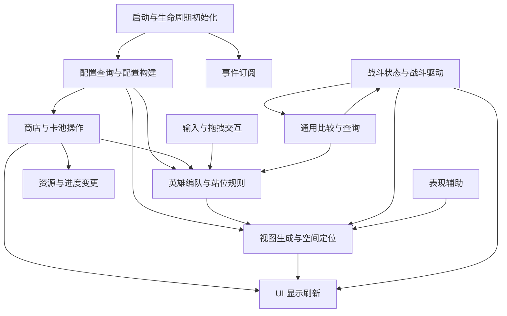
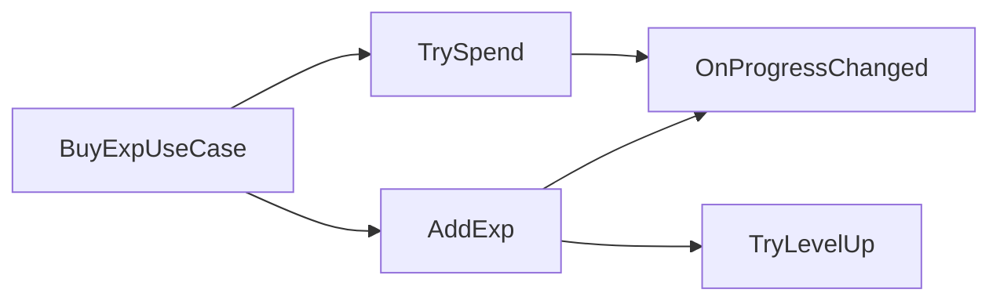
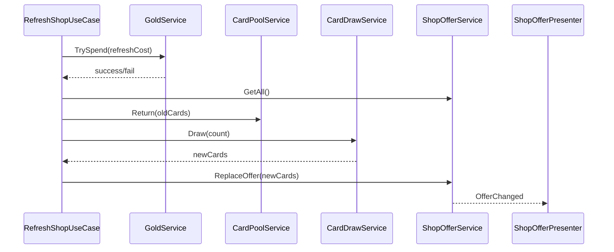
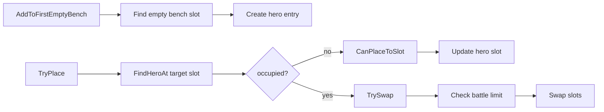
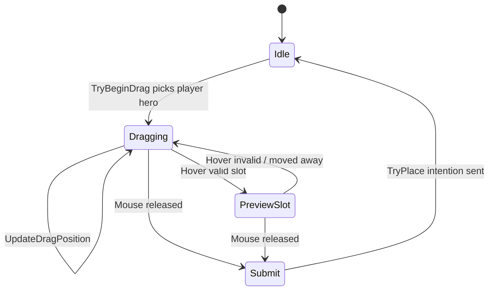
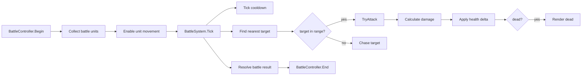

# Scripts 方法级群聚

来源: `Assets/AI/Scripts_UML.md`

目的: 不关注任何已有类边界，只按每个方法的实际行为进行群聚。表中的“来源方法”只用于追踪原始位置，不代表推荐归属。

## 方法级群聚总览

| 群聚 | 目标职责 | 包含的方法类型 |
|---|---|---|
| 启动与生命周期初始化 | 场景对象启动、缓存依赖、订阅事件、从配置初始化运行时数据 | `Start`, `Awake`, 初始化入口 |
| 配置查询与配置构建 | 从配置中查找数据、根据配置创建格子/阵容/库存 | 配置查找、构建棋盘、构建卡池、构建敌方阵容 |
| 资源与进度变更 | 金币、经验、等级等玩家进度的状态变化 | 加金币、消费金币、加经验、升级 |
| 商店与卡池操作 | 商店候选卡、抽卡、回收、购买、刷新 | 抽取、退回、设置卡牌、移除卡牌、买卡、刷新 |
| 英雄编队与站位规则 | 添加英雄、放置、交换、查找占位、统计上阵数 | 编队修改、站位查询、上阵限制 |
| 视图生成与空间定位 | 创建/销毁英雄视图，查询格子，摆放英雄视图 | 视图刷新、位置同步、格子查询 |
| UI 显示刷新 | 文本、图片、按钮、战斗结果等 UI 更新 | 金币文本、等级文本、卡牌 UI、人数 UI、结果 UI |
| 输入与拖拽交互 | 鼠标检测、拖拽、选择格子、提交放置意图 | 输入轮询、射线检测、预览选择、释放提交 |
| 战斗状态与战斗驱动 | 开战、战斗 Tick、冷却、寻敌、攻击、扣血、胜负 | 战斗启动、寻敌、伤害、死亡、结算 |
| 通用比较与查询 | 值对象相等、哈希、简单状态查询 | Equals、GetHashCode、Get、IsAlive |
| 表现辅助 | 非业务表现辅助 | Billboard 朝向摄像机 |

## 群聚图

## 群聚 1: 启动与生命周期初始化

这些方法本质都是“启动阶段准备环境”。建议目标归属不是业务模型，而是 Bootstrap、Installer、Presenter 初始化或 View 初始化。

| 来源方法 | 行为 | 推荐目标归属 |
|---|---|---|
| `Data.Gold.Start()` | 初始化金币为配置初始值并发出变化通知 | `ProgressBootstrap.InitializeGold()` |
| `OptionalCards.Start()` | 确保商店候选卡数组存在 | `ShopOfferBootstrap.InitializeOfferSlots()` |
| `EnemyHeroes.Awake()` | 从敌方配置生成敌方英雄数据 | `EnemyRosterBootstrap.BuildEnemyRoster()` |
| `Warehouse.Awake()` | 从卡池配置初始化库存 | `CardPoolBootstrap.BuildInitialPool()` |
| `Flow.Flow.Start()` | 初始化商店卡牌、订阅商店按钮、订阅敌方变化 | `GameStartupCoordinator.StartShopAndEnemySetup()` |
| `Flow.Battle.Start()` | 绑定开始战斗按钮 | `BattleStartButtonBinder.Bind()` |
| `Flow.HeroMover.Start()` | 缓存主摄像机 | `InputBootstrap.CacheCamera()` |
| `Flow.PlayerHeroesRefresher.Start()` | 订阅玩家英雄变化并立即同步视图 | `RosterViewSyncBootstrap.BindAndRefresh()` |
| `UI.UIShop.Start()` | 创建商店卡牌 UI，绑定按钮和模型变化 | `ShopPresenterBootstrap.BindShopView()` |
| `UI.UICard.Start()` | 绑定卡牌按钮点击 | `CardViewBootstrap.BindClick()` |
| `UI.UIBattleHeroNum.Start()` | 初始化上阵人数显示并订阅英雄变化 | `BattleHeroNumPresenterBootstrap.Bind()` |
| `BattleView.Awake()` | 构建战斗区格子 | `BoardBootstrap.BuildBattleBoard()` |
| `BenchView.Start()` | 构建备战区格子 | `BoardBootstrap.BuildBenchBoard()` |
| `Tool.Billboard.Awake()` | 缓存主摄像机 | `BillboardBootstrap.CacheCamera()` |

## 群聚 2: 配置查询与配置构建

这些方法都在“把配置转为可使用数据或对象”。建议和业务操作拆开，归入 Factory、Builder 或 ConfigQuery。

| 来源方法 | 行为 | 推荐目标归属 |
|---|---|---|
| `Config.HeroConfig.GetInfo(HeroType heroType)` | 按英雄类型查询英雄配置 | `HeroConfigQuery.GetStats(type)` |
| `BattleView.Build()` | 根据战斗区配置创建二维格子 | `BattleBoardBuilder.Build(config)` |
| `BenchView.Build()` | 根据备战区配置创建一维格子 | `BenchBoardBuilder.Build(config)` |
| `EnemyHeroes.Awake()` | 将敌人配置转换为敌方英雄运行时数据 | `EnemyRosterFactory.Create(enemyConfig)` |
| `Warehouse.Awake()` | 将卡池配置转换为库存字典 | `CardPoolFactory.Create(warehouseConfig)` |
| `HeroView.Initialize(int, bool, HeroType)` | 读取英雄配置并生成模型、初始化显示状态 | 应拆为 `HeroActorFactory.CreateView()` + `BattleUnitFactory.CreateState()` |
| `SlotView.Initialize(bool, SlotIndex)` | 初始化格子阵营和索引 | `SlotViewFactory.InitializeSlot()` |

## 群聚 3: 资源与进度变更

这些方法修改玩家长期/局内资源。建议作为 Progress 服务，和 UI 展示解耦。

| 来源方法 | 行为 | 推荐目标归属 |
|---|---|---|
| `Data.Gold.AddGold(int gold)` | 增加金币并通知 | `GoldService.Add(amount)` |
| `Data.Gold.ConsumeGold(int gold)` | 校验并扣除金币 | `GoldService.TrySpend(amount)` |
| `Data.Level.AddExp(int exp)` | 增加经验、循环升级、通知等级信息变化 | `LevelService.AddExp(amount)` + `LevelRule.TryLevelUp()` |
| `Flow.Flow.HandleBuyExp()` | 消耗金币购买经验 | `BuyExpUseCase.Execute()` |

### 目标关系

## 群聚 4: 商店与卡池操作

这些方法共同构成“商店货架 + 卡池库存 + 购买/刷新”能力。不要按当前类分散理解。

| 来源方法 | 行为 | 推荐目标归属 |
|---|---|---|
| `Warehouse.RandomTakeout(int count)` | 从库存随机抽取卡牌并扣库存 | `CardDrawService.Draw(count)` |
| `Warehouse.ReturnCards(HeroType[] cards)` | 将未购买卡牌退回库存 | `CardPoolService.Return(cards)` |
| `OptionalCards.Set(HeroType[] value)` | 设置当前商店候选卡 | `ShopOfferService.ReplaceOffer(cards)` |
| `OptionalCards.Get()` | 获取所有候选卡 | `ShopOfferQuery.GetAll()` |
| `OptionalCards.Get(int index)` | 获取指定候选卡 | `ShopOfferQuery.GetAt(index)` |
| `OptionalCards.RemoveAt(int index)` | 移除已购买候选卡 | `ShopOfferService.RemoveAt(index)` |
| `Flow.Flow.HandleCardClick(int index)` | 购买指定卡牌并加入英雄编队 | `BuyCardUseCase.Execute(index)` |
| `Flow.Flow.HandleShopRefresh()` | 消耗金币、回收旧卡、抽新卡 | `RefreshShopUseCase.Execute()` |
| `UI.UIShop.RefreshCards(HeroType[] heroTypes)` | 将候选卡数据显示到 UI | `ShopOfferPresenter.RenderCards(cards)` |
| `UI.UICard.SetType(HeroType heroType)` | 设置单张卡牌显示内容 | `CardPresenter.Render(type)` 或 `CardView.SetData()` |
| `UI.UICard.HandleButtonClick()` | 发出卡牌点击意图 | `CardClickEmitter.Emit()` |

### 商店方法流

## 群聚 5: 英雄编队与站位规则

这些方法处理“英雄是否存在、占哪个格子、能不能上阵、如何交换”。这是编队/摆放规则，不是 View 或输入。

| 来源方法 | 行为 | 推荐目标归属 |
|---|---|---|
| `Heroes.AddHeroToBench(HeroType heroType)` | 找空备战位并添加英雄 | `RosterService.AddToFirstEmptyBench(type)` |
| `Heroes.Place(int sourceHeroId, SlotIndex slotIndex)` | 将英雄放到目标格，必要时交换 | `PlacementService.TryPlace(heroId, targetSlot)` |
| `Heroes.Exchange(int sourceHeroId, int targetHeroId)` | 交换两个英雄位置并校验上阵限制 | `PlacementService.TrySwap(sourceId, targetId)` |
| `Heroes.GetHeroIdBySlotIndex(SlotIndex slotIndex)` | 查询目标格上的英雄 ID | `PlacementQuery.FindHeroAt(slot)` |
| `Heroes.GetBattleHeroCount()` | 统计战斗区英雄数量 | `LineupQuery.CountBattleUnits(camp)` |
| `SlotIndex.Equals(SlotIndex other)` | 判断两个格子是否相同 | `SlotIndex` 值对象行为 |
| `SlotIndex.Equals(object obj)` | object 版本格子相等判断 | `SlotIndex` 值对象行为 |
| `SlotIndex.GetHashCode()` | 为格子索引提供哈希 | `SlotIndex` 值对象行为 |
| `Flow.HeroMover.Update()` 中释放鼠标后的 `heroes.Place(...)` | 提交拖拽换位意图 | `PlacementController.TryPlaceFromDrag()` |

### 编队方法流

## 群聚 6: 视图生成与空间定位

这些方法只应该负责“显示对象存在吗、在哪、什么颜色、什么姿态”。它们不应该决定业务规则。

| 来源方法 | 行为 | 推荐目标归属 |
|---|---|---|
| `HeroesView.RefreshHeroes(Dictionary<int, HeroType> heroes)` | 根据英雄数据创建/销毁英雄视图 | `HeroViewRegistry.SyncHeroes(heroSnapshots)` |
| `HeroesView.GetHero(int heroId)` | 按 ID 查询英雄视图 | `HeroViewRegistry.Get(heroId)` |
| `BattleView.GetSlotView(int row, int col)` | 查询战斗区格子视图 | `BoardViewQuery.GetBattleSlot(row, col)` |
| `BenchView.GetSlotView(int index)` | 查询备战区格子视图 | `BoardViewQuery.GetBenchSlot(index)` |
| `Flow.Flow.HandleEnemyHeroesChange(Dictionary<int, EnemyHeroInfo> heroes)` | 同步敌方英雄视图并摆放到战斗格 | `EnemyRosterViewSynchronizer.Sync(heroes)` |
| `Flow.PlayerHeroesRefresher.HandleHeroesChange(Dictionary<int, HeroInfo> heroes)` | 同步玩家英雄视图并摆放到对应格子 | `PlayerRosterViewSynchronizer.Sync(heroes)` |
| `SlotView.SetSelected(bool selected)` | 设置格子选中表现 | `SlotSelectionView.SetSelected(selected)` |
| `SlotView.Refresh()` | 根据状态刷新格子颜色 | `SlotViewRenderer.Render(state)` |
| `HeroView.Initialize(...)` 中模型实例化部分 | 创建英雄模型和初始视觉 | `HeroActorView.InitializeVisual(type, camp)` |
| `HeroView.BeginBattle()` | 启用导航表现 | `HeroActorView.EnableMovement()` |

## 群聚 7: UI 显示刷新

这些方法属于“把状态翻译成 UI”。它们可以接收数据，但不应该自己决定业务。

| 来源方法 | 行为 | 推荐目标归属 |
|---|---|---|
| `UI.UIShop.RefreshLevel()` | 刷新等级经验文本 | `LevelPresenter.Render(level, exp, requiredExp)` |
| `UI.UIShop.RefreshGold(int goldNum)` | 刷新金币文本 | `GoldPresenter.Render(gold)` |
| `UI.UIShop.RefreshCards(HeroType[] heroTypes)` | 刷新商店卡牌列表 | `ShopOfferPresenter.Render(cards)` |
| `UI.UICard.SetType(HeroType heroType)` | 刷新单张卡牌图片和名字 | `CardView.Render(cardViewModel)` |
| `UI.UIBattleResult.SetResult(bool isWin)` | 显示胜负结果 | `BattleResultPresenter.Render(result)` |
| `UI.UIBattleHeroNum.Refresh()` | 显示当前/最大上阵人数 | `BattleHeroNumPresenter.Render(current, max)` |
| `UI.UIBattleHeroNum.HandleHeroesChange(Dictionary<int, HeroInfo> _)` | 响应英雄变化后刷新人数 UI | `BattleHeroNumPresenter.OnRosterChanged()` |
| `UI.UIShop.Start()` 中按钮绑定部分 | 将 UI 输入转成事件 | `ShopViewEventBinder.Bind()` |

## 群聚 8: 输入与拖拽交互

这些方法是“读取玩家输入并转成意图”。它们不应包含放置规则，只负责拾取对象、预览和提交。

| 来源方法 | 行为 | 推荐目标归属 |
|---|---|---|
| `Flow.HeroMover.Update()` 鼠标按下分支 | 射线拾取玩家英雄，记录拖拽起点 | `HeroDragInput.TryBeginDrag()` |
| `Flow.HeroMover.Update()` 鼠标按住分支 | 让英雄跟随鼠标平面移动 | `HeroDragInput.UpdateDragPosition()` |
| `Flow.HeroMover.Update()` 鼠标按住分支中的格子检测 | 射线拾取格子并设置预览选中 | `SlotHoverDetector.UpdateHoveredSlot()` |
| `Flow.HeroMover.Update()` 鼠标释放分支 | 还原位置、取消选中、提交放置意图 | `HeroDragInput.EndDragAndSubmit()` |

### 输入方法流

## 群聚 9: 战斗状态与战斗驱动

这些方法共同构成战斗系统。关键点是：寻敌、伤害、冷却、死亡、胜负都应归战斗域，不应由 View 单独负责。

| 来源方法 | 行为 | 推荐目标归属 |
|---|---|---|
| `Flow.Battle.BeginBattle()` | 开始战斗，启动单位，绑定攻击事件 | `BattleController.Begin()` |
| `Flow.Battle.Update()` | 每帧驱动双方寻敌并检查胜负 | `BattleSystem.Tick(deltaTime)` + `BattleResultResolver.Resolve()` |
| `Flow.Battle.GetPlayerBattleHeroViews()` | 收集玩家上阵单位视图 | `BattleUnitCollector.GetPlayerUnits()` |
| `Flow.Battle.HandleAttack(HeroView attacker, HeroView defender)` | 根据攻防计算伤害并扣血 | `DamageCalculator.Calculate()` + `DamageApplier.Apply()` |
| `Flow.Battle.EndBattle(bool isWin)` | 结束战斗并通知结果显示 | `BattleController.End(result)` |
| `HeroView.Update()` | 更新攻击冷却 | `CombatCooldownSystem.Tick(unit, deltaTime)` |
| `HeroView.FindTarget(HeroView[] candidates)` | 寻找最近目标、追击、进攻、切动画 | 拆为 `TargetingSystem.FindNearest()`, `CombatSystem.TryAttack()`, `MovementSystem.Chase()`, `HeroAnimationPresenter.RenderCombatState()` |
| `HeroView.ChangeBlood(int delta)` | 修改血量、刷新血条、死亡隐藏 | 拆为 `HealthService.ApplyDelta()`, `HealthPresenter.Render()`, `DeathPresenter.RenderDead()` |
| `HeroView.IsAlive()` | 判断是否存活 | `BattleUnitQuery.IsAlive(unit)` |
| `HeroView.BeginBattle()` | 启动导航移动能力 | `BattleUnitPresenter.EnterBattle()` |

### 战斗方法流

## 群聚 10: 通用比较与查询

这些方法基本是无副作用查询或值对象行为。建议保持简单、可测试。

| 来源方法 | 行为 | 推荐目标归属 |
|---|---|---|
| `SlotIndex.Equals(SlotIndex other)` | 值对象相等比较 | `SlotIndex` |
| `SlotIndex.Equals(object obj)` | object 相等比较 | `SlotIndex` |
| `SlotIndex.GetHashCode()` | 哈希生成 | `SlotIndex` |
| `HeroesView.GetHero(int heroId)` | 查询英雄视图 | `HeroViewRegistryQuery` |
| `BattleView.GetSlotView(int row, int col)` | 查询战斗格视图 | `BoardViewQuery` |
| `BenchView.GetSlotView(int index)` | 查询备战格视图 | `BoardViewQuery` |
| `OptionalCards.Get()` | 查询所有候选卡 | `ShopOfferQuery` |
| `OptionalCards.Get(int index)` | 查询单个候选卡 | `ShopOfferQuery` |
| `Heroes.GetHeroIdBySlotIndex(SlotIndex slotIndex)` | 查询格子占用 | `PlacementQuery` |
| `Heroes.GetBattleHeroCount()` | 查询上阵数量 | `LineupQuery` |
| `HeroView.IsAlive()` | 查询存活状态 | `BattleUnitQuery` |
| `Config.HeroConfig.GetInfo(HeroType heroType)` | 查询英雄配置 | `HeroConfigQuery` |

## 群聚 11: 表现辅助

| 来源方法 | 行为 | 推荐目标归属 |
|---|---|---|
| `Tool.Billboard.LateUpdate()` | 每帧让对象朝向摄像机 | `BillboardView.FaceCamera()` |

## 每个方法的推荐群聚索引

| 来源方法 | 推荐群聚 |
|---|---|
| `HeroesView.RefreshHeroes(Dictionary<int, HeroType>)` | 视图生成与空间定位 |
| `HeroesView.GetHero(int)` | 通用比较与查询 |
| `SlotIndex.Equals(SlotIndex)` | 通用比较与查询 |
| `SlotIndex.Equals(object)` | 通用比较与查询 |
| `SlotIndex.GetHashCode()` | 通用比较与查询 |
| `HeroView.Initialize(int, bool, HeroType)` | 配置查询与配置构建 / 视图生成与空间定位 / 战斗状态与战斗驱动 |
| `HeroView.ChangeBlood(int)` | 战斗状态与战斗驱动 / UI 显示刷新 |
| `HeroView.IsAlive()` | 通用比较与查询 |
| `HeroView.BeginBattle()` | 战斗状态与战斗驱动 / 视图生成与空间定位 |
| `HeroView.Update()` | 战斗状态与战斗驱动 |
| `HeroView.FindTarget(HeroView[])` | 战斗状态与战斗驱动 |
| `SlotView.Initialize(bool, SlotIndex)` | 配置查询与配置构建 / 视图生成与空间定位 |
| `SlotView.SetSelected(bool)` | 视图生成与空间定位 |
| `SlotView.Refresh()` | 视图生成与空间定位 |
| `BattleView.Build()` | 配置查询与配置构建 |
| `BattleView.Awake()` | 启动与生命周期初始化 |
| `BattleView.GetSlotView(int, int)` | 通用比较与查询 |
| `BenchView.Build()` | 配置查询与配置构建 |
| `BenchView.Start()` | 启动与生命周期初始化 |
| `BenchView.GetSlotView(int)` | 通用比较与查询 |
| `UI.UIShop.Start()` | 启动与生命周期初始化 / UI 显示刷新 |
| `UI.UIShop.RefreshLevel()` | UI 显示刷新 |
| `UI.UIShop.RefreshCards(HeroType[])` | UI 显示刷新 / 商店与卡池操作 |
| `UI.UIShop.RefreshGold(int)` | UI 显示刷新 |
| `UI.UICard.Start()` | 启动与生命周期初始化 |
| `UI.UICard.SetType(HeroType)` | UI 显示刷新 |
| `UI.UICard.HandleButtonClick()` | 商店与卡池操作 |
| `UI.UIBattleResult.SetResult(bool)` | UI 显示刷新 |
| `UI.UIBattleHeroNum.Start()` | 启动与生命周期初始化 |
| `UI.UIBattleHeroNum.HandleHeroesChange(Dictionary<int, HeroInfo>)` | UI 显示刷新 |
| `UI.UIBattleHeroNum.Refresh()` | UI 显示刷新 |
| `Config.HeroConfig.GetInfo(HeroType)` | 配置查询与配置构建 / 通用比较与查询 |
| `Heroes.AddHeroToBench(HeroType)` | 英雄编队与站位规则 |
| `Heroes.Place(int, SlotIndex)` | 英雄编队与站位规则 |
| `Heroes.Exchange(int, int)` | 英雄编队与站位规则 |
| `Heroes.GetHeroIdBySlotIndex(SlotIndex)` | 英雄编队与站位规则 / 通用比较与查询 |
| `Heroes.GetBattleHeroCount()` | 英雄编队与站位规则 / 通用比较与查询 |
| `Data.Gold.Start()` | 启动与生命周期初始化 |
| `Data.Gold.AddGold(int)` | 资源与进度变更 |
| `Data.Gold.ConsumeGold(int)` | 资源与进度变更 |
| `EnemyHeroes.Awake()` | 启动与生命周期初始化 / 配置查询与配置构建 |
| `OptionalCards.Start()` | 启动与生命周期初始化 |
| `OptionalCards.Set(HeroType[])` | 商店与卡池操作 |
| `OptionalCards.Get()` | 商店与卡池操作 / 通用比较与查询 |
| `OptionalCards.Get(int)` | 商店与卡池操作 / 通用比较与查询 |
| `OptionalCards.RemoveAt(int)` | 商店与卡池操作 |
| `Data.Level.AddExp(int)` | 资源与进度变更 |
| `Warehouse.Awake()` | 启动与生命周期初始化 / 配置查询与配置构建 |
| `Warehouse.ReturnCards(HeroType[])` | 商店与卡池操作 |
| `Warehouse.RandomTakeout(int)` | 商店与卡池操作 |
| `Flow.Flow.Start()` | 启动与生命周期初始化 |
| `Flow.Flow.HandleCardClick(int)` | 商店与卡池操作 / 英雄编队与站位规则 |
| `Flow.Flow.HandleShopRefresh()` | 商店与卡池操作 / 资源与进度变更 |
| `Flow.Flow.HandleEnemyHeroesChange(Dictionary<int, EnemyHeroInfo>)` | 视图生成与空间定位 |
| `Flow.Flow.HandleBuyExp()` | 资源与进度变更 |
| `Flow.Battle.Start()` | 启动与生命周期初始化 |
| `Flow.Battle.BeginBattle()` | 战斗状态与战斗驱动 |
| `Flow.Battle.GetPlayerBattleHeroViews()` | 战斗状态与战斗驱动 / 通用比较与查询 |
| `Flow.Battle.EndBattle(bool)` | 战斗状态与战斗驱动 / UI 显示刷新 |
| `Flow.Battle.Update()` | 战斗状态与战斗驱动 |
| `Flow.Battle.HandleAttack(HeroView, HeroView)` | 战斗状态与战斗驱动 |
| `Flow.HeroMover.Start()` | 启动与生命周期初始化 |
| `Flow.HeroMover.Update()` | 输入与拖拽交互 / 英雄编队与站位规则 |
| `Flow.PlayerHeroesRefresher.Start()` | 启动与生命周期初始化 |
| `Flow.PlayerHeroesRefresher.HandleHeroesChange(Dictionary<int, HeroInfo>)` | 视图生成与空间定位 |
| `Tool.Billboard.Awake()` | 启动与生命周期初始化 |
| `Tool.Billboard.LateUpdate()` | 表现辅助 |

## 最值得拆出的目标方法组

| 优先级 | 目标方法组 | 应收纳的方法 |
|---|---|---|
| 1 | `BattleSystem.Tick / TargetingSystem / DamageCalculator / HealthService` | `HeroView.FindTarget`, `HeroView.Update`, `HeroView.ChangeBlood`, `Flow.Battle.Update`, `Flow.Battle.HandleAttack` |
| 2 | `PlacementService / PlacementQuery / LineupRules` | `Heroes.Place`, `Heroes.Exchange`, `Heroes.GetHeroIdBySlotIndex`, `Heroes.GetBattleHeroCount`, `Heroes.AddHeroToBench` |
| 3 | `ShopUseCases / CardPoolService / ShopOfferService` | `Warehouse.RandomTakeout`, `Warehouse.ReturnCards`, `OptionalCards.Set/Get/RemoveAt`, `Flow.HandleCardClick`, `Flow.HandleShopRefresh` |
| 4 | `Presenters / ViewSynchronizers` | `UIShop.Refresh*`, `UICard.SetType`, `UIBattleHeroNum.Refresh`, `PlayerHeroesRefresher.HandleHeroesChange`, `Flow.HandleEnemyHeroesChange` |
| 5 | `Bootstrap / Binder` | 所有 `Start` / `Awake` 中的订阅、缓存、初始化方法 |
