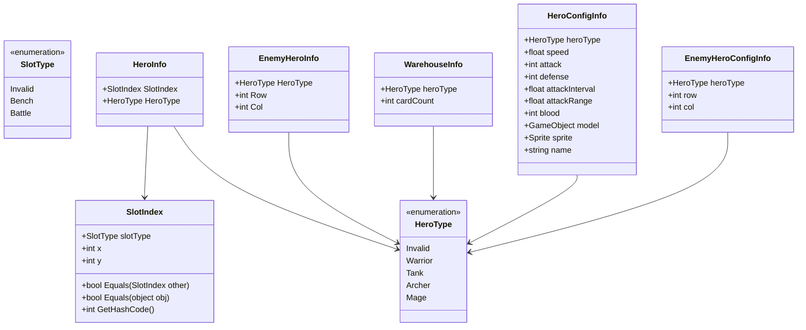
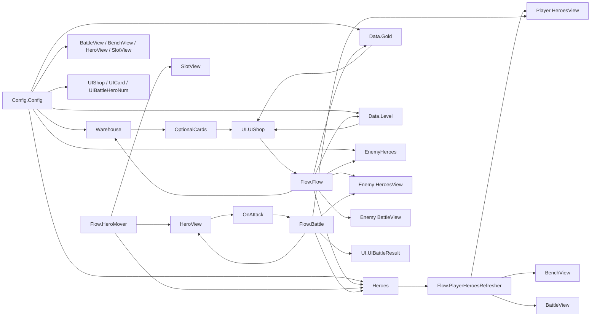
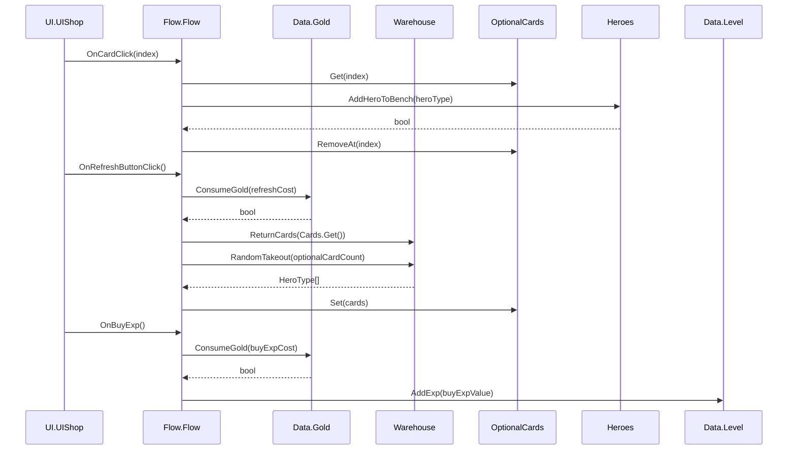
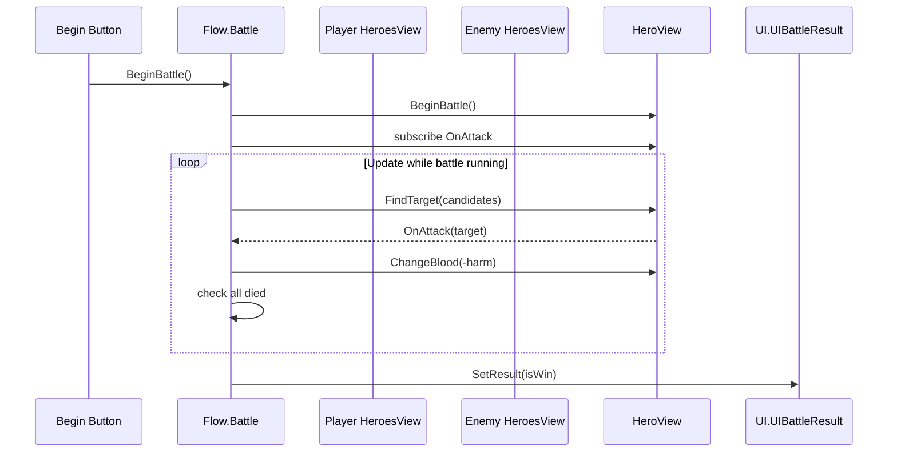

# Assets/Scripts UML 总览

范围: `Assets/Scripts/**/*.cs`

## 脚本归属总表

| 模块 | 文件 | 类型 | 主要职责 |
|---|---|---|---|
| 根目录/视图 | `HeroesView.cs` | `HeroesView : MonoBehaviour` | 根据英雄数据创建、移除、查询 `HeroView`。 |
| 根目录/视图 | `HeroView.cs` | `HeroView : MonoBehaviour` | 单个英雄的显示、血量、移动、寻敌、攻击触发。 |
| 根目录/视图 | `SlotView.cs` | `SlotView : MonoBehaviour` | 单个格子的初始化、选中状态和颜色刷新。 |
| 根目录/视图 | `BattleView.cs` | `BattleView : MonoBehaviour` | 构建战斗区格子并按行列查询格子。 |
| 根目录/视图 | `BenchView.cs` | `BenchView : MonoBehaviour` | 构建备战区格子并按索引查询格子。 |
| 根目录/数据类型 | `SlotIndex.cs` | `SlotIndex : struct` | 表示格子类型和坐标，可用于相等比较。 |
| 根目录/枚举 | `HeroType.cs` | `HeroType : enum` | 英雄类型枚举。 |
| 根目录/枚举 | `SlotType.cs` | `SlotType : enum` | 格子类型枚举。 |
| UI | `UI/UIShop.cs` | `UI.UIShop : MonoBehaviour` | 商店卡牌、金币、等级和购买经验 UI。 |
| UI | `UI/UICard.cs` | `UI.UICard : MonoBehaviour` | 单张商店卡牌 UI。 |
| UI | `UI/UIBattleResult.cs` | `UI.UIBattleResult : MonoBehaviour` | 战斗结果 UI。 |
| UI | `UI/UIBattleHeroNum.cs` | `UI.UIBattleHeroNum : MonoBehaviour` | 当前上阵人数 UI。 |
| Config | `Config/Config.cs` | `Config.Config : ScriptableObject` | 全局配置入口。 |
| Config | `Config/HeroConfig.cs` | `Config.HeroConfig` / `HeroConfigInfo` | 英雄数值、模型、图片配置。 |
| Config | `Config/WarehouseConfig.cs` | `Config.WarehouseConfig` / `WarehouseInfo` | 卡池初始配置。 |
| Config | `Config/EnemyConfig.cs` | `Config.EnemyConfig` / `EnemyHeroConfigInfo` | 敌方阵容配置。 |
| Data | `Data/Heroes.cs` | `Heroes : MonoBehaviour` / `HeroInfo` | 玩家英雄数据、位置、交换和上阵数量。 |
| Data | `Data/Gold.cs` | `Data.Gold : MonoBehaviour` | 金币数据、增加和消费。 |
| Data | `Data/EnemyHeroes.cs` | `EnemyHeroes : MonoBehaviour` / `EnemyHeroInfo` | 敌方英雄运行时数据。 |
| Data | `Data/OptionalCards.cs` | `OptionalCards : MonoBehaviour` | 商店备选卡牌数据。 |
| Data | `Data/Level.cs` | `Data.Level : MonoBehaviour` | 玩家等级和经验。 |
| Data | `Data/Warehouse.cs` | `Warehouse : MonoBehaviour` | 卡池抽卡和回收。 |
| Flow | `Flow/Flow.cs` | `Flow.Flow : MonoBehaviour` | 商店、金币、经验、敌方显示的主流程连接。 |
| Flow | `Flow/Battle.cs` | `Flow.Battle : MonoBehaviour` | 战斗开始、寻敌、伤害和胜负判断。 |
| Flow | `Flow/HeroMover.cs` | `Flow.HeroMover : MonoBehaviour` | 鼠标拖拽英雄换位。 |
| Flow | `Flow/PlayerHeroesRefresher.cs` | `Flow.PlayerHeroesRefresher : MonoBehaviour` | 玩家英雄数据变化后刷新视图位置。 |
| Tool | `Tool/BillBoard.cs` | `Tool.Billboard : MonoBehaviour` | 始终朝向主摄像机。 |

## 方法归属清单

### 根目录/视图与基础类型

| 归属 | 成员/方法 | 类型 | 可见性 | 说明 |
|---|---|---|---|---|
| `HeroesView` | `Heroes : Dictionary<int, HeroView>` | 属性 | `public` | 暴露当前英雄视图字典。 |
| `HeroesView` | `RefreshHeroes(Dictionary<int, HeroType> heroes) : void` | 方法 | `public` | 根据英雄类型字典补齐新英雄视图，并移除不存在的英雄视图。 |
| `HeroesView` | `GetHero(int heroId) : HeroView` | 方法 | `public` | 按英雄 ID 查询英雄视图，可能返回 `null`。 |
| `SlotIndex` | `Equals(SlotIndex other) : bool` | 方法 | `public` | 比较格子类型和坐标是否一致。 |
| `SlotIndex` | `Equals(object obj) : bool` | 方法 | `public override` | object 版本相等比较。 |
| `SlotIndex` | `GetHashCode() : int` | 方法 | `public override` | 根据 `slotType/x/y` 生成哈希。 |
| `HeroView` | `Info : HeroConfigInfo` | 属性 | `public` | 暴露英雄配置数据。 |
| `HeroView` | `Initialize(int inId, bool inIsEnemy, HeroType heroType) : void` | 方法 | `public` | 初始化英雄 ID、阵营、配置、血量、模型、导航和血条颜色。 |
| `HeroView` | `ChangeBlood(int delta) : void` | 方法 | `public` | 修改血量并刷新血条，血量小于等于 0 时隐藏对象。 |
| `HeroView` | `IsAlive() : bool` | 方法 | `public` | 判断英雄是否存活。 |
| `HeroView` | `BeginBattle() : void` | 方法 | `public` | 启用 `NavMeshAgent`。 |
| `HeroView` | `Update() : void` | Unity 生命周期 | `private` | 更新攻击冷却。 |
| `HeroView` | `FindTarget(HeroView[] candidates) : void` | 方法 | `public` | 寻找最近存活目标，进入射程则攻击，否则移动追击。 |
| `SlotView` | `Initialize(bool inIsEnemy, SlotIndex inIndex) : void` | 方法 | `public` | 初始化阵营和格子索引。 |
| `SlotView` | `SetSelected(bool selected) : void` | 方法 | `public` | 设置选中状态并刷新颜色。 |
| `SlotView` | `Refresh() : void` | 方法 | `private` | 根据敌我、选中状态和格子类型设置颜色。 |
| `BattleView` | `Build() : void` | ContextMenu/方法 | `private` | 根据配置创建战斗区二维格子。 |
| `BattleView` | `Awake() : void` | Unity 生命周期 | `private` | 初始化构建战斗区。 |
| `BattleView` | `GetSlotView(int row, int col) : SlotView` | 方法 | `public` | 按行列查询战斗格子，越界返回 `null`。 |
| `BenchView` | `Build() : void` | ContextMenu/方法 | `private` | 根据配置创建备战区格子。 |
| `BenchView` | `Start() : void` | Unity 生命周期 | `private` | 初始化构建备战区。 |
| `BenchView` | `GetSlotView(int index) : SlotView` | 方法 | `public` | 按索引查询备战格子，越界返回 `null`。 |

### UI 模块

| 归属 | 成员/方法 | 类型 | 可见性 | 说明 |
|---|---|---|---|---|
| `UI.UIShop` | `OnCardClick : Action<int>` | 回调字段 | `public` | 点击卡牌时通知卡牌索引。 |
| `UI.UIShop` | `OnRefreshButtonClick : Action` | 回调字段 | `public` | 点击刷新按钮时通知。 |
| `UI.UIShop` | `OnBuyExp : Action` | 回调字段 | `public` | 点击购买经验按钮时通知。 |
| `UI.UIShop` | `Start() : void` | Unity 生命周期 | `private` | 创建卡牌 UI，绑定卡牌、金币、等级和按钮事件。 |
| `UI.UIShop` | `RefreshLevel() : void` | 方法 | `private` | 刷新等级经验文本。 |
| `UI.UIShop` | `RefreshCards(HeroType[] heroTypes) : void` | 方法 | `private` | 根据备选英雄类型刷新卡牌。 |
| `UI.UIShop` | `RefreshGold(int goldNum) : void` | 方法 | `private` | 刷新金币文本。 |
| `UI.UICard` | `OnClickButton : Action` | 回调字段 | `public` | 卡牌按钮点击回调。 |
| `UI.UICard` | `Start() : void` | Unity 生命周期 | `private` | 绑定按钮点击事件。 |
| `UI.UICard` | `SetType(HeroType heroType) : void` | 方法 | `public` | 设置卡牌英雄类型，刷新图片和名称，无效类型隐藏。 |
| `UI.UICard` | `HandleButtonClick() : void` | 方法 | `private` | 触发 `OnClickButton`。 |
| `UI.UIBattleResult` | `SetResult(bool isWin) : void` | 方法 | `public` | 设置胜负文本。 |
| `UI.UIBattleHeroNum` | `Start() : void` | Unity 生命周期 | `private` | 初始化人数显示并订阅英雄变化。 |
| `UI.UIBattleHeroNum` | `HandleHeroesChange(Dictionary<int, HeroInfo> _) : void` | 方法 | `private` | 响应英雄数据变化并刷新。 |
| `UI.UIBattleHeroNum` | `Refresh() : void` | 方法 | `private` | 显示当前上阵人数和最大上阵人数。 |

### Config 模块

| 归属 | 成员/方法 | 类型 | 可见性 | 说明 |
|---|---|---|---|---|
| `Config.HeroConfig` | `GetInfo(HeroType heroType) : HeroConfigInfo` | 方法 | `public` | 按英雄类型查询英雄配置，找不到返回 `default`。 |
| `Config.Config` | 配置字段集合 | 字段 | `public` | 卡牌数量、格子数量、颜色、费用、等级经验、英雄配置、敌人配置等。 |
| `Config.WarehouseConfig` | `infos : WarehouseInfo[]` | 字段 | `public` | 每种英雄卡牌初始数量。 |
| `Config.EnemyConfig` | `enemyHeroInfos : List<EnemyHeroConfigInfo>` | 字段 | `public` | 敌方英雄类型和站位。 |

### Data 模块

| 归属 | 成员/方法 | 类型 | 可见性 | 说明 |
|---|---|---|---|---|
| `Heroes` | `OnHeroesChange : Action<Dictionary<int, HeroInfo>>` | 回调字段 | `public` | 玩家英雄数据变化通知。 |
| `Heroes` | `Infos : Dictionary<int, HeroInfo>` | 属性 | `public` | 暴露玩家英雄数据字典。 |
| `Heroes` | `AddHeroToBench(HeroType heroType) : bool` | 方法 | `public` | 找空闲备战格添加英雄，成功触发变化通知。 |
| `Heroes` | `Place(int sourceHeroId, SlotIndex slotIndex) : void` | 方法 | `public` | 将英雄移动到目标格，目标有英雄则交换。 |
| `Heroes` | `Exchange(int sourceHeroId, int targetHeroId) : void` | 方法 | `private` | 交换两个英雄的格子，受最大上阵数量限制。 |
| `Heroes` | `GetHeroIdBySlotIndex(SlotIndex slotIndex) : int?` | 方法 | `private` | 根据格子索引查找英雄 ID。 |
| `Heroes` | `GetBattleHeroCount() : int` | 方法 | `public` | 统计当前上阵英雄数量。 |
| `Data.Gold` | `OnGoldChange : Action<int>` | 回调字段 | `public` | 金币变化通知。 |
| `Data.Gold` | `Value : int` | 属性 | `public` | 当前金币数量。 |
| `Data.Gold` | `Start() : void` | Unity 生命周期 | `private` | 初始化金币数量并通知。 |
| `Data.Gold` | `AddGold(int gold) : void` | 方法 | `public` | 增加金币并通知。 |
| `Data.Gold` | `ConsumeGold(int gold) : bool` | 方法 | `public` | 金币足够则扣除并返回 `true`，否则返回 `false`。 |
| `EnemyHeroes` | `OnEnemyHeroInfoChange : Action<Dictionary<int, EnemyHeroInfo>>` | 回调字段 | `public` | 敌方英雄数据变化通知。 |
| `EnemyHeroes` | `Infos : Dictionary<int, EnemyHeroInfo>` | 属性 | `public` | 暴露敌方英雄数据字典。 |
| `EnemyHeroes` | `Awake() : void` | Unity 生命周期 | `private` | 从配置构建敌方英雄运行时字典。 |
| `OptionalCards` | `OnChange : Action<HeroType[]>` | 回调字段 | `public` | 备选卡牌变化通知。 |
| `OptionalCards` | `Start() : void` | Unity 生命周期 | `private` | 确保卡牌数组已初始化。 |
| `OptionalCards` | `Set(HeroType[] value) : void` | 方法 | `public` | 替换备选卡牌并通知。 |
| `OptionalCards` | `Get() : HeroType[]` | 方法 | `public` | 返回全部备选卡牌。 |
| `OptionalCards` | `Get(int index) : HeroType` | 方法 | `public` | 按索引返回卡牌类型，越界返回 `Invalid`。 |
| `OptionalCards` | `RemoveAt(int index) : void` | 方法 | `public` | 将指定卡牌置为 `Invalid` 并通知。 |
| `Data.Level` | `OnLevelInfoChange : Action<int, int>` | 回调字段 | `public` | 等级或经验变化通知。 |
| `Data.Level` | `LevelValue : int` | 属性 | `public` | 当前等级。 |
| `Data.Level` | `CurrExp : int` | 属性 | `public` | 当前经验。 |
| `Data.Level` | `AddExp(int exp) : bool` | 方法 | `public` | 增加经验，按配置升级并通知；已达配置上限时返回 `false`。 |
| `Warehouse` | `Awake() : void` | Unity 生命周期 | `private` | 从卡池配置初始化每种英雄卡牌数量。 |
| `Warehouse` | `ReturnCards(HeroType[] cards) : void` | 方法 | `public` | 将卡牌退回卡池。 |
| `Warehouse` | `RandomTakeout(int count) : HeroType[]` | 方法 | `public` | 从卡池随机抽取指定数量卡牌并扣减库存。 |

### Flow 与 Tool 模块

| 归属 | 成员/方法 | 类型 | 可见性 | 说明 |
|---|---|---|---|---|
| `Flow.Flow` | `Start() : void` | Unity 生命周期 | `private` | 初始化商店卡牌，绑定商店、经验、敌方英雄变化事件。 |
| `Flow.Flow` | `HandleCardClick(int index) : void` | 方法 | `private` | 买入指定商店卡牌到备战区，成功后移除卡牌。 |
| `Flow.Flow` | `HandleShopRefresh() : void` | 方法 | `private` | 消耗金币刷新商店，并回收旧卡牌。 |
| `Flow.Flow` | `HandleEnemyHeroesChange(Dictionary<int, EnemyHeroInfo> heroes) : void` | 方法 | `private` | 刷新敌方英雄视图并摆放到敌方战斗格。 |
| `Flow.Flow` | `HandleBuyExp() : void` | 方法 | `private` | 消耗金币购买经验。 |
| `Flow.Battle` | `Start() : void` | Unity 生命周期 | `private` | 绑定开始战斗按钮。 |
| `Flow.Battle` | `BeginBattle() : void` | 方法 | `private` | 隐藏按钮，启动双方英雄战斗并绑定攻击回调。 |
| `Flow.Battle` | `GetPlayerBattleHeroViews() : HeroView[]` | 方法 | `private` | 根据玩家英雄数据筛选战斗区英雄视图。 |
| `Flow.Battle` | `EndBattle(bool isWin) : void` | 方法 | `private` | 显示战斗结果。 |
| `Flow.Battle` | `Update() : void` | Unity 生命周期 | `private` | 驱动双方寻敌，并判断胜负。 |
| `Flow.Battle` | `HandleAttack(HeroView attacker, HeroView defender) : void` | 方法 | `private static` | 根据攻击和防御计算伤害并扣血。 |
| `Flow.HeroMover` | `Start() : void` | Unity 生命周期 | `public` | 缓存主摄像机。 |
| `Flow.HeroMover` | `Update() : void` | Unity 生命周期 | `private` | 处理鼠标按下、拖拽、格子选中和释放落位。 |
| `Flow.PlayerHeroesRefresher` | `Start() : void` | Unity 生命周期 | `private` | 订阅玩家英雄变化并立即刷新。 |
| `Flow.PlayerHeroesRefresher` | `HandleHeroesChange(Dictionary<int, HeroInfo> heroes) : void` | 方法 | `private` | 根据数据刷新玩家英雄视图和位置。 |
| `Tool.Billboard` | `Awake() : void` | Unity 生命周期 | `private` | 缓存主摄像机。 |
| `Tool.Billboard` | `LateUpdate() : void` | Unity 生命周期 | `private` | 将对象旋转同步为摄像机旋转。 |

## 数据结构与枚举

## 主要类图

```mermaid
classDiagram
    class MonoBehaviour
    class ScriptableObject

    class Config_Config {
        +int optionalCardCount
        +HeroConfig heroConfig
        +WarehouseConfig warehouseConfig
        +int battleRow
        +int battleCol
        +int benchCount
        +int battleHeroMaxNum
        +EnemyConfig enemyConfig
        +List~int~ levelExp
        +int refreshCost
        +int initialGoldNum
        +int buyExpCost
        +int buyExpValue
    }

    class Config_HeroConfig {
        +HeroConfigInfo[] infos
        +HeroConfigInfo GetInfo(HeroType heroType)
    }

    class Config_WarehouseConfig {
        +WarehouseInfo[] infos
    }

    class Config_EnemyConfig {
        +List~EnemyHeroConfigInfo~ enemyHeroInfos
    }

    class Heroes {
        +Action~Dictionary~ OnHeroesChange
        +Dictionary~int,HeroInfo~ Infos
        +bool AddHeroToBench(HeroType heroType)
        +void Place(int sourceHeroId, SlotIndex slotIndex)
        -void Exchange(int sourceHeroId, int targetHeroId)
        -int? GetHeroIdBySlotIndex(SlotIndex slotIndex)
        +int GetBattleHeroCount()
    }

    class Data_Gold {
        +Action~int~ OnGoldChange
        +int Value
        -void Start()
        +void AddGold(int gold)
        +bool ConsumeGold(int gold)
    }

    class Data_Level {
        +Action~int,int~ OnLevelInfoChange
        +int LevelValue
        +int CurrExp
        +bool AddExp(int exp)
    }

    class OptionalCards {
        +Action~HeroType[]~ OnChange
        -void Start()
        +void Set(HeroType[] value)
        +HeroType[] Get()
        +HeroType Get(int index)
        +void RemoveAt(int index)
    }

    class Warehouse {
        -void Awake()
        +void ReturnCards(HeroType[] cards)
        +HeroType[] RandomTakeout(int count)
    }

    class EnemyHeroes {
        +Action~Dictionary~ OnEnemyHeroInfoChange
        +Dictionary~int,EnemyHeroInfo~ Infos
        -void Awake()
    }

    class HeroesView {
        +Dictionary~int,HeroView~ Heroes
        +void RefreshHeroes(Dictionary~int,HeroType~ heroes)
        +HeroView GetHero(int heroId)
    }

    class HeroView {
        +int id
        +bool isEnemy
        +Action~HeroView~ OnAttack
        +HeroConfigInfo Info
        +void Initialize(int inId, bool inIsEnemy, HeroType heroType)
        +void ChangeBlood(int delta)
        +bool IsAlive()
        +void BeginBattle()
        -void Update()
        +void FindTarget(HeroView[] candidates)
    }

    class SlotView {
        +bool isEnemy
        +SlotIndex index
        +void Initialize(bool inIsEnemy, SlotIndex inIndex)
        +void SetSelected(bool selected)
        -void Refresh()
    }

    class BattleView {
        -void Build()
        -void Awake()
        +SlotView GetSlotView(int row, int col)
    }

    class BenchView {
        -void Build()
        -void Start()
        +SlotView GetSlotView(int index)
    }

    class UI_UIShop {
        +Action~int~ OnCardClick
        +Action OnRefreshButtonClick
        +Action OnBuyExp
        -void Start()
        -void RefreshLevel()
        -void RefreshCards(HeroType[] heroTypes)
        -void RefreshGold(int goldNum)
    }

    class UI_UICard {
        +Action OnClickButton
        -void Start()
        +void SetType(HeroType heroType)
        -void HandleButtonClick()
    }

    class UI_UIBattleResult {
        +void SetResult(bool isWin)
    }

    class UI_UIBattleHeroNum {
        -void Start()
        -void HandleHeroesChange(Dictionary~int,HeroInfo~ heroes)
        -void Refresh()
    }

    class Flow_Flow {
        -void Start()
        -void HandleCardClick(int index)
        -void HandleShopRefresh()
        -void HandleEnemyHeroesChange(Dictionary~int,EnemyHeroInfo~ heroes)
        -void HandleBuyExp()
    }

    class Flow_Battle {
        -void Start()
        -void BeginBattle()
        -HeroView[] GetPlayerBattleHeroViews()
        -void EndBattle(bool isWin)
        -void Update()
        -void HandleAttack(HeroView attacker, HeroView defender)
    }

    class Flow_HeroMover {
        +void Start()
        -void Update()
    }

    class Flow_PlayerHeroesRefresher {
        -void Start()
        -void HandleHeroesChange(Dictionary~int,HeroInfo~ heroes)
    }

    class Tool_Billboard {
        -void Awake()
        -void LateUpdate()
    }

    ScriptableObject <|-- Config_Config
    MonoBehaviour <|-- Heroes
    MonoBehaviour <|-- Data_Gold
    MonoBehaviour <|-- Data_Level
    MonoBehaviour <|-- OptionalCards
    MonoBehaviour <|-- Warehouse
    MonoBehaviour <|-- EnemyHeroes
    MonoBehaviour <|-- HeroesView
    MonoBehaviour <|-- HeroView
    MonoBehaviour <|-- SlotView
    MonoBehaviour <|-- BattleView
    MonoBehaviour <|-- BenchView
    MonoBehaviour <|-- UI_UIShop
    MonoBehaviour <|-- UI_UICard
    MonoBehaviour <|-- UI_UIBattleResult
    MonoBehaviour <|-- UI_UIBattleHeroNum
    MonoBehaviour <|-- Flow_Flow
    MonoBehaviour <|-- Flow_Battle
    MonoBehaviour <|-- Flow_HeroMover
    MonoBehaviour <|-- Flow_PlayerHeroesRefresher
    MonoBehaviour <|-- Tool_Billboard

    Config_Config --> Config_HeroConfig
    Config_Config --> Config_WarehouseConfig
    Config_Config --> Config_EnemyConfig
    Heroes --> Config_Config
    Data_Gold --> Config_Config
    Data_Level --> Config_Config
    OptionalCards --> Config_Config
    Warehouse --> Config_Config
    EnemyHeroes --> Config_Config
    HeroView --> Config_Config
    SlotView --> Config_Config
    BattleView --> Config_Config
    BenchView --> Config_Config
    UI_UIShop --> Config_Config
    UI_UICard --> Config_Config
    UI_UIBattleHeroNum --> Config_Config
```

## 模块交互图

## 关键事件流

## 备注

| 位置 | 说明 |
|---|---|
| `HeroesView.RefreshHeroes` | 当前实现遍历 `_heroes.Keys` 时可能在循环中 `Remove` 字典元素，运行时可能触发集合修改异常。此文档只整理 UML，没有修改源码。 |
| `Data.Level.AddExp` | `while (_currExp >= config.levelExp[_level])` 中升级后没有再次检查 `_level < config.levelExp.Count`，如果一次性获得大量经验，存在越界风险。 |
| `Warehouse.RandomTakeout` | 如果卡池剩余数量少于 `count`，`Random.Range(0, allCards.Count)` 可能在空列表上执行。 |
